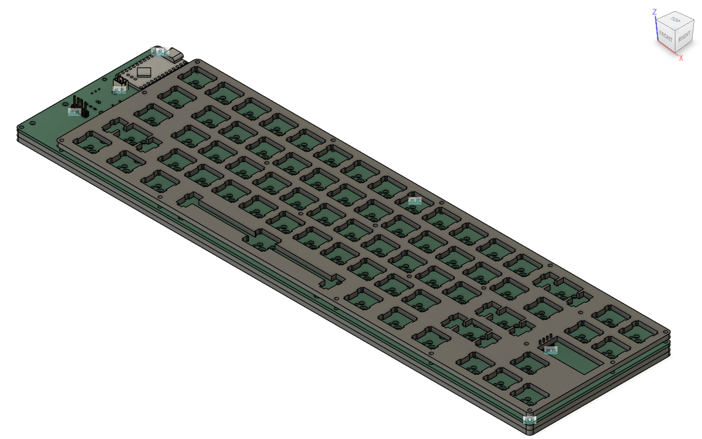

# Design was taken from [WhiteBoard by mintexists](https://github.com/mintexists/WhiteBoard/tree/main)

## Keyboard form factor

This keyboard is a 65% Keyboard with a knob and place for 2 screens to go onto 

### 3D model of the keyboard parts 

#### Top Plate

#### Bot Plate

#### PCB

#### Assembly

## Tools

### Kayboard Layout Editor 

[Keyboard layout editor](https://www.keyboard-layout-editor.com/##@@=~%0A%60&=!%0A1&=%2F@%0A2&=%23%0A3&=$%0A4&=%25%0A5&=%5E%0A6&=%2F&%0A7&=*%0A8&=(%0A9&=)%0A0&=%2F_%0A-&=+%0A%2F=&_w:2%3B&=Backspace&_x:0.25%3B&=Insert&=Page%20Up%3B&@_w:1.5%3B&=Tab&=Q&=W&=E&=R&=T&=Y&=U&=I&=O&=P&=%7B%0A%5B&=%7D%0A%5D&_w:1.5%3B&=%7C%0A%5C&_x:0.25%3B&=Delete&=Page%20Down%3B&@_w:1.75%3B&=Caps%20Lock&=A&=S&=D&=F&=G&=H&=J&=K&=L&=%2F:%0A%2F%3B&=%22%0A'&_w:2.25%3B&=Enter%3B&@_w:2.25%3B&=Shift&=Z&=X&=C&=V&=B&=N&=M&=%3C%0A,&=%3E%0A.&=%3F%0A%2F%2F&_w:2.75%3B&=Shift&_x:0.25%3B&=%E2%86%91%3B&@_w:1.25%3B&=Ctrl&_w:1.25%3B&=Win&_w:1.25%3B&=Alt&_a:7&w:6.25%3B&=&_a:4&w:1.25%3B&=Alt&_w:1.25%3B&=Ctrl&_w:1.25%3B&=Menu&_x:0.5%3B&=%E2%86%90&=%E2%86%93&=%E2%86%92) is used for the holes for top plate. Though it may be unnecessary but aesthetics ig.

### Builder

[builder](http://builder.swillkb.com/) for the mounting holes. Copying the layout and adding pasting it into builder gives u the generated mounting holes.

### SVG2ShenZhen

[Badgeek's SVG to ShenZhen](https://github.com/badgeek/svg2shenzhen) makes svg into components in kicad.
